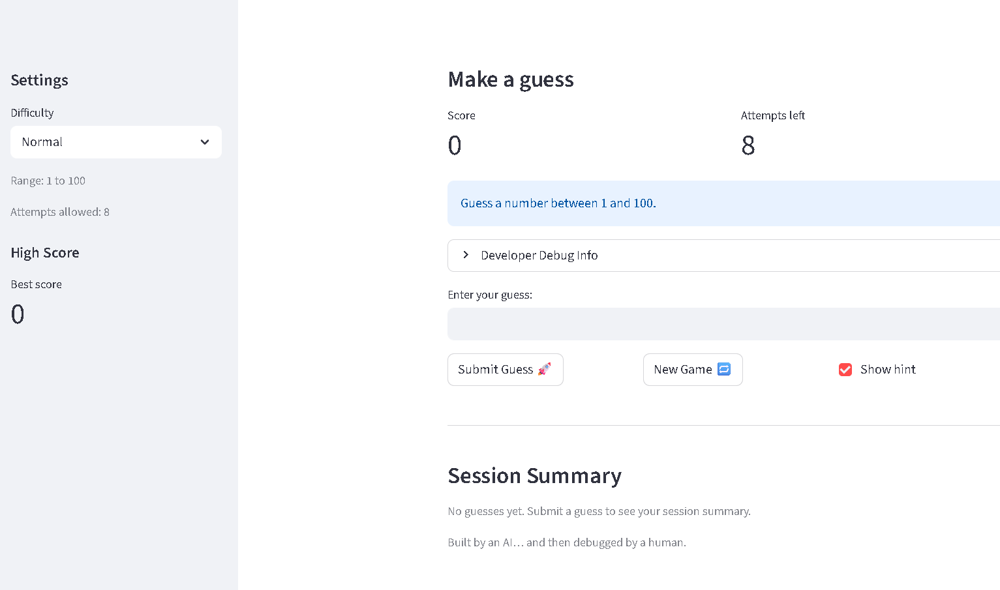
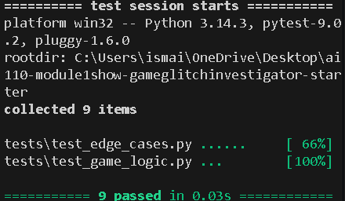
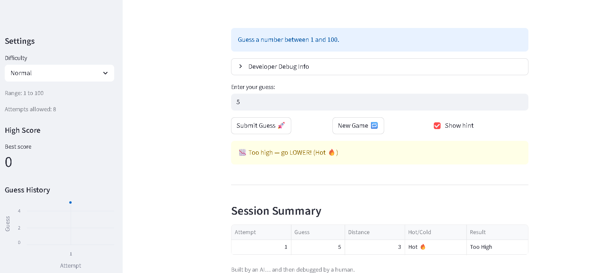

# 🎮 Game Glitch Investigator: The Impossible Guesser

## 🚨 The Situation

This repo is a Streamlit number guessing game that started out *very* buggy (wrong hints, weird state resets, confusing UI).

## 🛠️ Setup

1. Install dependencies: `pip install -r requirements.txt`
2. Run the app: `python -m streamlit run app.py`
3. Run tests: `python -m pytest`

## 📝 Document Your Experience

- [x] **Purpose:** A number guessing game where you try to find the secret number in a limited number of attempts.
- [x] **Bugs found:** Backwards hints, “New Game” ignoring difficulty range, confusing state/attempt behavior.
- [x] **Fixes applied:** Moved logic into `logic_utils.py`, fixed hint logic + state resets, added tests, and improved the UI/summary output.

## 📸 Demo
- 

## ✅ Optional Extensions Completed

### Challenge 1: Advanced Edge-Case Testing

- Added extra pytest coverage for edge inputs (whitespace, decimals, negatives, huge values).
- 
### Challenge 2: Feature Expansion

- Added a **persistent High Score** that saves to `high_score.json`.
- Added a **Guess History** view (sidebar chart + session summary table).

### Challenge 3: Documentation / PEP 8

- Added professional docstrings and type hints in `logic_utils.py`.
- Cleaned up code style and naming.

### Challenge 4: Enhanced Game UI

- Added “Hot/Warm/Cold” feedback based on distance from the secret.
- Added a session summary table.
- 

### Challenge 5: AI Model Comparison

- Added a short comparison section in `reflection.md`.
